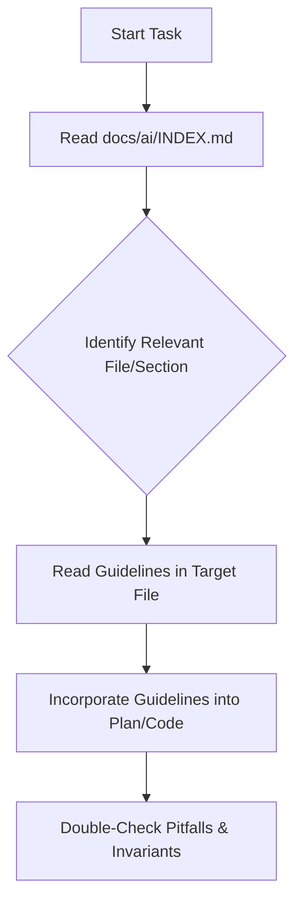

# Align Context with Horizon Docs

## Overview

This skill ensures that all proposed code changes, database migrations, DTO scopes, and feature designs align with Horizon's authoritative architecture, product, and engineering guidelines. It prevents architectural drift and ensures compliance with project constraints.

---

## When to Use

### Triggering Conditions
* Before creating or updating an implementation plan (`implementation_plan.md`).
* Before drafting a feature specification.
* Before writing, refactoring, or modifying source code (except for documentation-only changes).

### Symptoms of Non-Compliance
* Creating state fields (like `status` or boolean flags like `is_archived`) instead of factual timestamps (violating the **Facts Over States** design).
* Accessing another module's internal classes directly (violating the **Cross-Module Communication** boundary).
* Performing user authorization checks inside application services rather than filtering at the repository level.
* Proposing complex architectures (e.g. Event-Driven, Microservices, CQRS) which are explicitly rejected for Horizon.

---

## Core Pattern: Document Lookup & Alignment

Before writing plans or code, follow these steps:

### Step 1: Read the Documentation Index Map
Read [docs/ai/INDEX.md](./../../../docs/ai/INDEX.md) to locate the files and specific section headings relevant to the current request.

### Step 2: Read Guidelines
Open the referenced documents using `view_file` at the exact sections found in the index. Pay special attention to:
* **Product scope**: Check if the requested feature violates any V1 non-goals in [HORIZON_PRODUCT_CONTEXT.md](./../../../docs/ai/HORIZON_PRODUCT_CONTEXT.md).
* **Architecture constraints**: Check module communication boundaries in [HORIZON_ARCHITECTURE_CONTEXT.md](./../../../docs/ai/HORIZON_ARCHITECTURE_CONTEXT.md).
* **Database / Persistence model**: Look up column types and naming patterns in [HORIZON_ENGINEERING_CONTEXT.md](./../../../docs/ai/HORIZON_ENGINEERING_CONTEXT.md).
* **Coding and Testing Conventions**: Refer to [ENG-001 Engineering Guidelines v1.0.md](./../../../docs/ai/ENG-001%20Engineering%20Guidelines%20v1.0.md) or [ENG-002 - Frontend Engineering Guide.md](./../../../docs/ai/ENG-002%20-%20Frontend%20Engineering%20Guide.md).

### Step 3: Document Compliance
Explicitly mention in your implementation plan how the design adheres to these guidelines. For example:
> *Database: We are using a `completed_at TIMESTAMPTZ` field to align with the **Facts Over States** principle mapped in `INDEX.md`.*

---

## Quick Reference: Key Invariants

| Invariant | Standard | Target Document |
| :--- | :--- | :--- |
| **Lifecycle Tracking** | Use timestamps (e.g. `archived_at`) instead of status enums/booleans. | [HORIZON_ARCHITECTURE_CONTEXT.md](./../../../docs/ai/HORIZON_ARCHITECTURE_CONTEXT.md#6-persistence-architecture) |
| **Cross-Module Boundaries** | Inter-module calls must only traverse `module.api`. | [HORIZON_ARCHITECTURE_CONTEXT.md](./../../../docs/ai/HORIZON_ARCHITECTURE_CONTEXT.md#2-system-architecture) |
| **Security Gates** | Perform ownership validation at the Repository query level (`findByIdAndUserId`). | [HORIZON_ARCHITECTURE_CONTEXT.md](./../../../docs/ai/HORIZON_ARCHITECTURE_CONTEXT.md#5-ownership--authorization-model) |
| **Error Handling** | Return `404 Not Found` for non-owned items. Return RFC 9457 Problem Details. | [HORIZON_ARCHITECTURE_CONTEXT.md](./../../../docs/ai/HORIZON_ARCHITECTURE_CONTEXT.md#9-api-architecture) |

---

## Common Mistakes & Loops

* **Excuse**: *"This is just a simple CRUD endpoint; I don't need to check the index."*
  * **Reality**: Even basic endpoints can violate core rules (such as returning a 403 instead of 404, or using the wrong column naming convention). Always check the index.
* **Excuse**: *"I'll model it as a boolean `is_completed` flag since it's easier."*
  * **Reality**: This violates the **Facts Over States** principle. Use `completed_at` timestamp.
* **Excuse**: *"I can bypass `module.api` for this one read query."*
  * **Reality**: Any cross-module leakage breaks modular monolith encapsulation. All cross-module access must go through the API layer.
