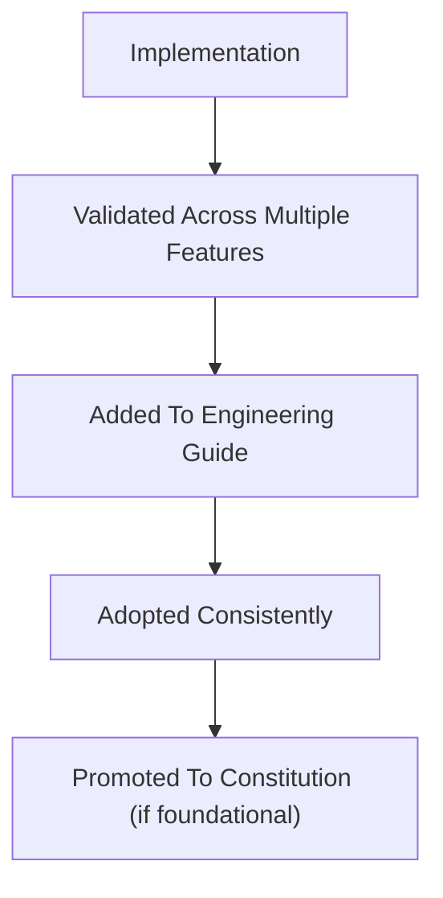

# ENG-002 — Frontend Engineering Guide

|Field|Value|
|---|---|
|**Document ID**|ENG-002|
|**Document Name**|Frontend Engineering Guide|
|**Version**|1.0|
|**Status**|Living|
|**Owner**|Horizon Engineering|
|**Created Date**|2026-06-27|
|**Last Updated**|2026-06-27|

---

# 1. Purpose

## Overview

This document defines the frontend engineering conventions used throughout Horizon.

It exists to ensure frontend development remains:

- Consistent
- Maintainable
- Modular
- Predictable
- AI-friendly

Unlike the Constitution, this guide focuses on **implementation practices** rather than long-term architectural principles.

The guide is expected to evolve as implementation progresses.

Patterns that become stable and foundational may later be promoted into the Horizon Constitution.

---

# 2. Scope

## This Guide Covers

- Frontend project organization
- Ownership boundaries
- Feature organization
- Routing conventions
- Layout conventions
- Shared component strategy
- State management conventions
- Naming conventions
- AI-assisted development practices
---

## This Guide Does Not Cover

- Product behavior (PRDs)
- Architecture decisions (ADRs)
- Backend implementation
- Story-specific implementation details (Implementation Specifications)
---

# 3. Guiding Principles

The frontend should prioritize:

- Simplicity over cleverness
- Explicit structure over implicit behavior
- Feature ownership over shared complexity
- Composition over inheritance
- Consistency over local optimization
- Incremental evolution
- AI-friendly organization
---

# 4. Ownership Model

## Core Principle

> [!IMPORTANT]
> Application composes. Features own behavior.

---

## Application Layer

The application layer is responsible for composing the application.

It owns:

- Application bootstrap
- Routing
- Layout
- Providers
- Global configuration
- Authentication wiring

The application layer must never contain business behavior.

---

## Feature Layer

Each feature owns its complete vertical slice.

Typical ownership includes:

- Routes
- Components
- Forms
- API client
- Queries
- Types
- Feature-specific hooks
- Business behavior

Features should be independently understandable.

---

## Shared Layer

The shared layer contains reusable technical building blocks.

Examples include:

- UI primitives
- Utility hooks
- API infrastructure
- Utility functions
- Shared types
- Constants

Business workflows do not belong in the shared layer.

---

# 5. Project Structure

The frontend follows a feature-oriented structure.

```
src/
├── app/
│   ├── bootstrap/
│   ├── config/
│   ├── layout/
│   ├── providers/
│   └── router/
├── features/
│   ├── auth/
│   ├── home/
│   ├── today/
│   ├── inbox/
│   ├── task/
│   ├── note/
│   └── settings/
├── shared/
│   ├── api/
│   ├── components/
│   ├── constants/
│   ├── hooks/
│   ├── lib/
│   ├── types/
│   └── utils/
└── assets/
```

The structure should evolve intentionally rather than organically.

---

# 6. Routing

## Feature Ownership

Features own their routes from the beginning of implementation.

Placeholder routes are preferred over temporary application pages.

---

## Application Routing

The application router composes feature routes.

The router should not contain business logic.

---

## Canonical Routes

Each primary experience owns a canonical route.

Examples:

```
//today/inbox/tasks/notes/settings
```

---

# 7. Layout

The application owns the shared layout.

Every authenticated experience renders inside the common application shell.

Layout components belong under:

```
app/layout
```

Features must not implement their own application layouts.

---

# 8. Feature Independence

Features should remain independent.

A feature may depend on:

- Shared
- Application infrastructure

A feature should not depend on another feature's internal implementation.

Cross-feature interaction should occur through explicit public contracts.

---

# 9. Shared Components

Shared components should emerge through demonstrated reuse.

Avoid creating abstractions based solely on anticipated future requirements.

A component should generally exist in a feature until multiple features require it.

---

# 10. State Management

Frontend state should follow clear ownership.

## Server State

Server state is managed using TanStack Query.

Responsibilities include:

- Fetching
- Caching
- Synchronization
- Mutation lifecycle
---

## Local UI State

Local UI state belongs inside React components.

Examples include:

- Dialog visibility
- Expanded sections
- Temporary form state
- Selection state
---

## Global State

Global state should be introduced only when simpler alternatives become insufficient.

Avoid unnecessary global stores.

---

# 11. Naming Conventions

Names should communicate responsibility.

Examples:

- AppLayout
- AppHeader
- AppSidebar
- TaskList
- TaskRoute
- TaskApi
- TaskQueries

Avoid generic names such as:

- Helper
- Manager
- Common
- Utils

unless they genuinely describe generic responsibilities.

---

# 12. AI Development Guidelines

AI should assist in maintaining consistency rather than introducing novelty.

Generated code should:

- Follow existing project structure
- Reuse established patterns
- Preserve feature boundaries
- Avoid unnecessary abstractions
- Prefer explicit implementations
- Keep code readable and predictable

When uncertain, AI should follow existing conventions rather than inventing new ones.

---

# 13. Evolution Process

Engineering conventions evolve through implementation.

The expected lifecycle is:



The guide should remain a practical engineering reference rather than a theoretical document.

---

# 14. Change Log

|Version|Date|Changes|
|---|---|---|
|1.0|2026-06-27|Initial version created to establish frontend engineering conventions before frontend implementation begins.|
